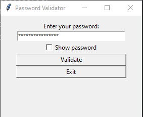
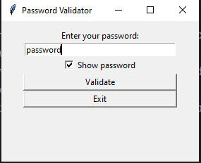
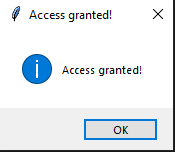
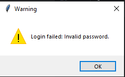
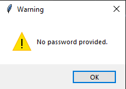

# Password Validator

A **GUI**-based password validator built with Python, Tkinter and bcrypt.
The Password Validator allows users to input and validate passwords in a secure manner. It compares the user-entered
password with a predefined one stored in an environment variable, using bcrypt hashing for security. This project
demonstrates secure authentication workflows in a desktop GUI context.

## Environment Setup

1. Create a .env file or set the environment variable manually.
2. Make sure **MY_PASSWORD** is set before running the application.

## Technologies Used

- Python 3.6 or later.
- Tkinter
- bcrypt
- Logging

## Features

- **GUI Interface:** User-friendly interface built with Tkinter.

- **Password Masking:** Password entry field masks the input for privacy.
- **Show/Hide Password:** Toggle to view or hide the entered password.
- **Secure Password Hashing:** Uses bcrypt to hash and compare passwords.
- **Logging:** Logs successful and failed login attempts to a file.
- **Error Handling:** Displays informative message boxes for various conditions.

